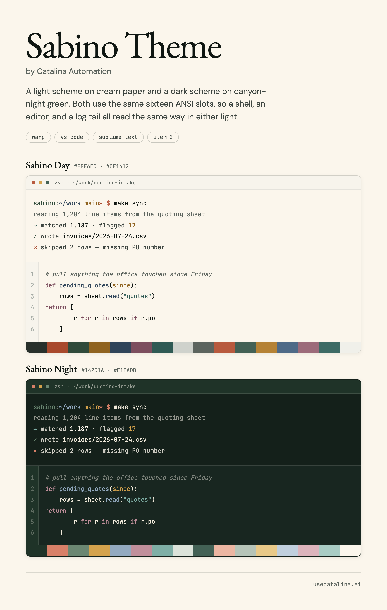

# Sabino Theme

A quiet Sonoran color scheme for terminals and text UI, by [Catalina Automation](https://usecatalina.ai).
Two variants, **Sabino Day** (cream) and **Sabino Night** (canyon green), sharing
the same sixteen ANSI slots, so a shell, an editor, and a log tail read the same way
in either light.

**[Browse and download at usecatalina.ai/sabino](https://usecatalina.ai/sabino)**

    background   #FBF6EC / #14201A
    foreground   #0F1612 / #F1EADB
    accent       #B85A3E / #D4A24C
    cursor       #B58235 / #D4A24C

Green means it worked, clay means it stopped, gold means look at this. Nothing else
gets to be loud. Dusk navy carries paths and identifiers.

## Warp

    mkdir -p ~/.warp/themes
    cp warp/sabino_*.yaml ~/.warp/themes/

Then Settings › Appearance › Themes. Restart Warp if the two don't appear.
Windows: `%APPDATA%\warp\Warp\data\themes`. Linux: `~/.local/share/warp-terminal/themes`.

## VS Code

Download the packaged extension from [usecatalina.ai/sabino](https://usecatalina.ai/sabino)
and install it:

    code --install-extension sabino-theme-1.0.0.vsix

Or install this folder as a local extension:

    cp -r vscode ~/.vscode/extensions/catalina-automation.sabino-theme-1.0.0

Reload the window, then Preferences › Color Theme › Sabino Day / Sabino Night.
To build the `.vsix` yourself, run `npx @vscode/vsce package` inside `vscode/`.

## Sublime Text

    cp sublime/Sabino*.sublime-color-scheme "$HOME/Library/Application Support/Sublime Text/Packages/User/"

Then Preferences › Select Color Scheme. On Linux the path is
`~/.config/sublime-text/Packages/User/`; on Windows `%APPDATA%\Sublime Text\Packages\User\`.

## Obsidian

    mkdir -p /path/to/vault/.obsidian/themes/Sabino
    cp obsidian/manifest.json obsidian/theme.css /path/to/vault/.obsidian/themes/Sabino/

Then Settings › Appearance › Themes › Sabino. Obsidian carries both variants in
one theme: Appearance › Base color scheme picks Day or Night, and "Adapt to
system" moves between them with the OS.

## iTerm2

Settings › Profiles › Colors › Color Presets › Import, pick both `.itermcolors`
files, then select the preset you want.

## Notes

ANSI needs magenta and cyan, which the brand palette does not carry. Both are mixed
from clay and dusk, and from saguaro and dusk, so they stay in the same dusty family.
Obsidian additionally needs an orange, for callouts and canvas; it is mixed from clay
and gold the same way.

Every normal slot clears 4.5:1 against its own background; bright slots clear 3:1 for
large glyphs and box drawing. In Obsidian, where links are running body text rather
than chrome, they take the normal clay instead of the brighter accent so they clear
4.5:1 too. The accent still fills buttons, badges, and the marker on the active note.

## License

MIT. See [LICENSE](LICENSE).
